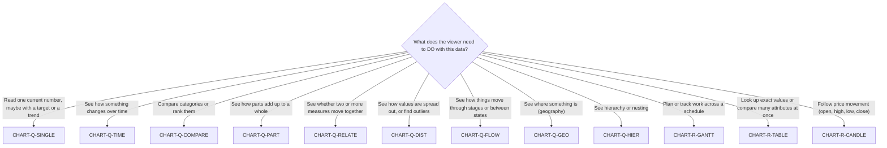
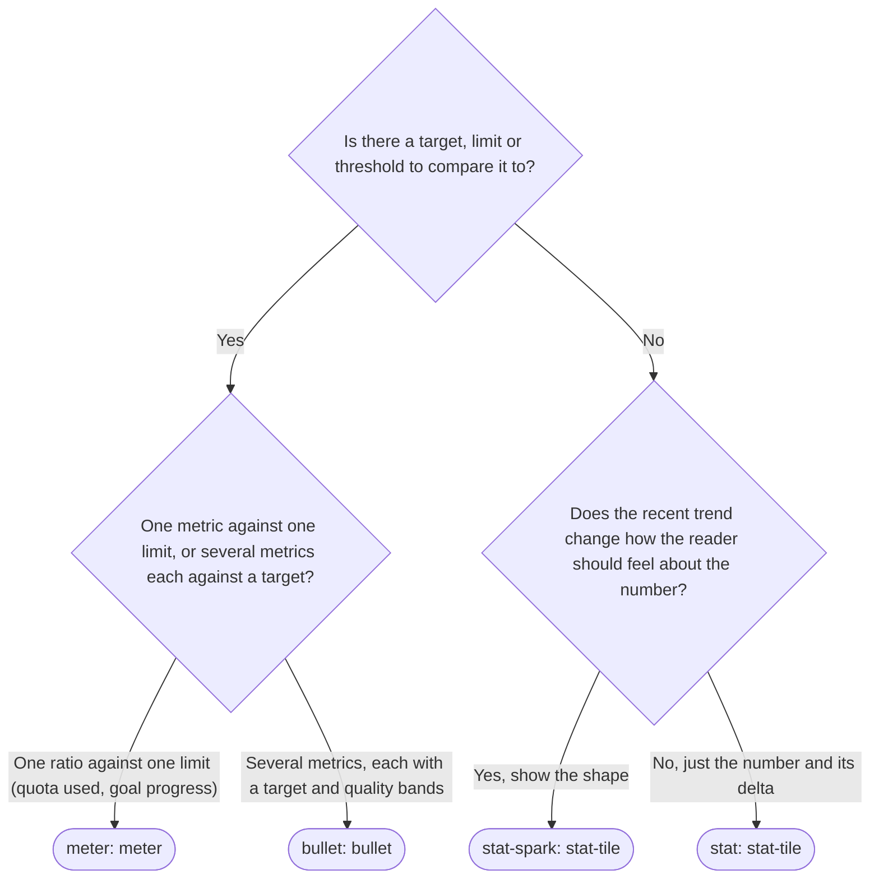
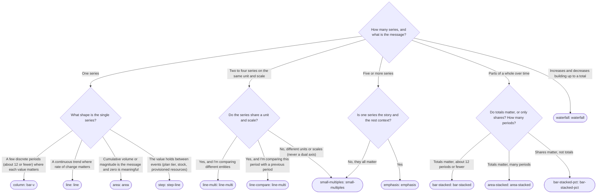
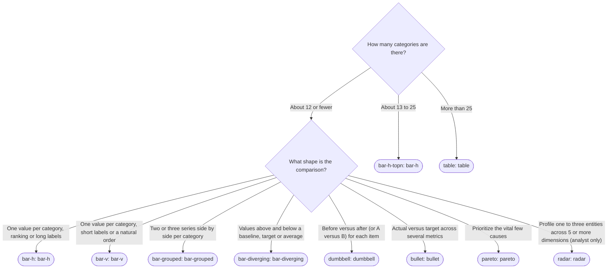
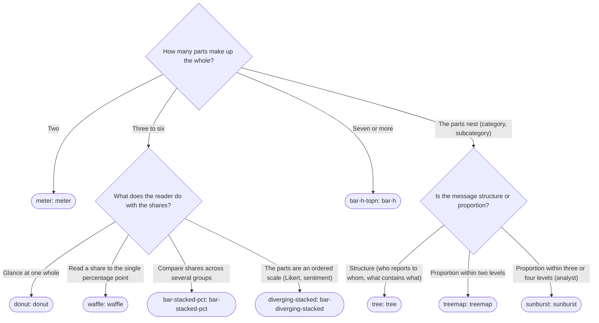
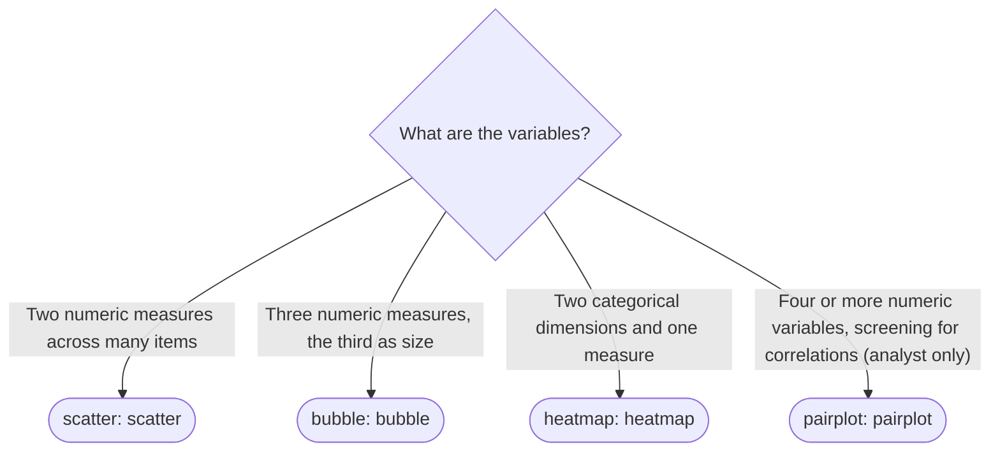
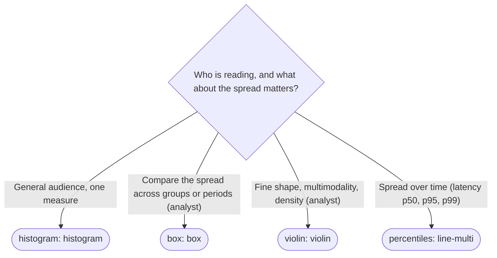
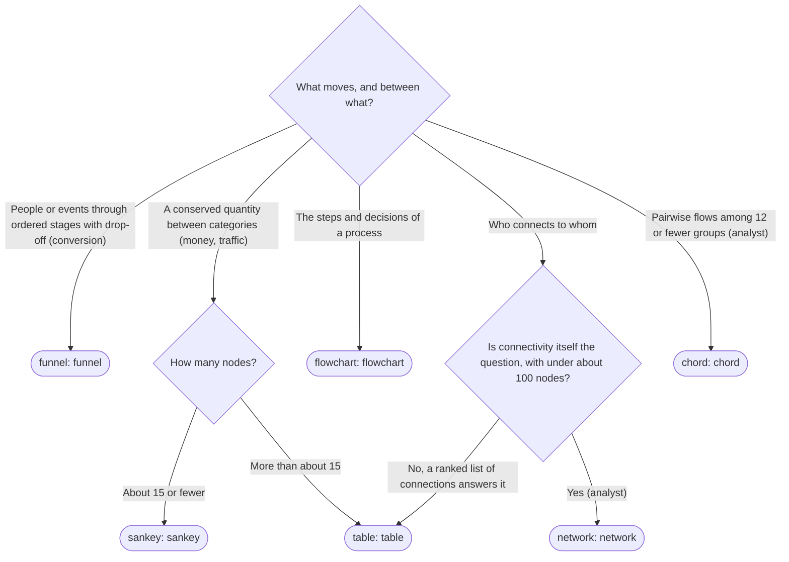
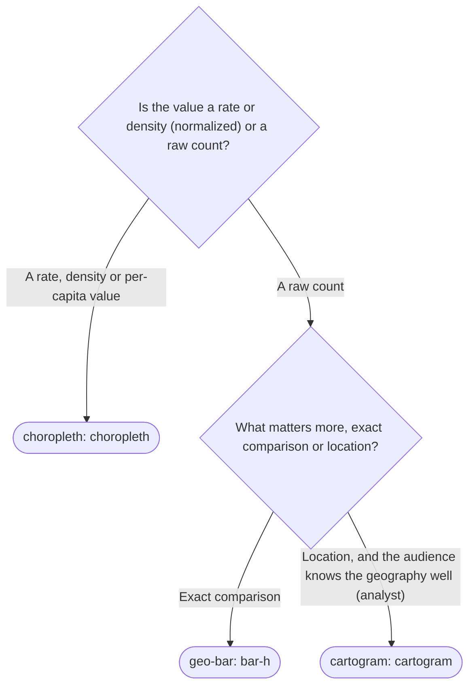
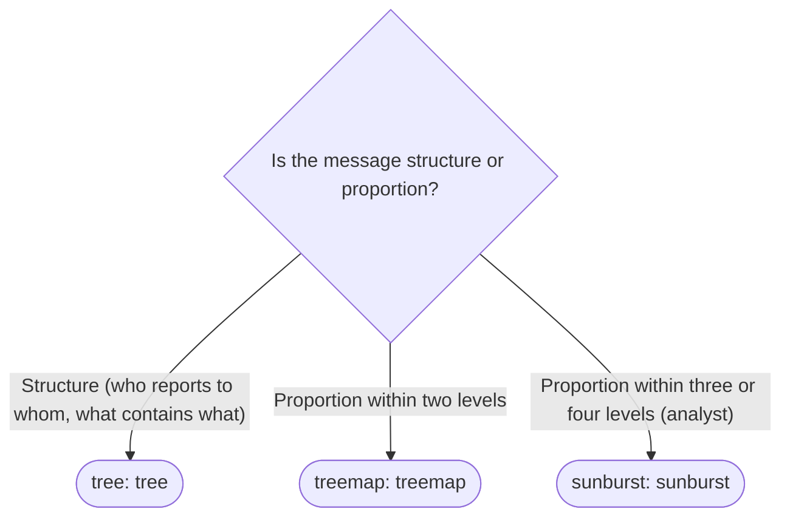

<!-- GENERATED from data/decision-tree.json by scripts/build-reference.mjs. Edit the JSON, then run `node vois-dataviz/scripts/build-reference.mjs`. Do not edit by hand. -->

# Chart selection decision tree

Start at `CHART-Q-ROOT`. Ask the question, follow the option, stop at a result. Then run the gates. The same tree is in `data/decision-tree.json` for programs; `scripts/check-spec.mjs --tree <job>` lists every form a job can reach.

## Top level

## Gates every result must clear

- **GATE-AUDIENCE:** If the audience is unknown or general, only forms with fit 'core' or 'situational' and audience 'general' may be the final answer. Forms with audience 'analyst' or fit 'rare' need spec.audience analyst and a how-to-read note. (`[DV-PURPOSE-002]`, `[DV-FORM-005]`)
- **GATE-SIMPLER:** Is there a simpler catalog form with the same job that loses nothing the reader needs? If so, use it. (`[DV-FORM-002]`)
- **GATE-SERIES:** Series above 8 is never solved by more hues. Fold into Other, facet, or isolate. Series above 4 loses direct labels; above 5 needs emphasis or small multiples. (`[DV-COLOR-003]`, `[DV-FILTER-007]`)
- **GATE-SCALE:** Two measures on different scales never share a plot. Small multiples, two charts, or index to a common base. (`[DV-HONEST-002]`)
- **GATE-TWIN:** Every result ships with a table view and a text alternative. (`[DV-A11Y-003]`, `[DV-A11Y-004]`)
- **GATE-VOLUME:** Over about 500 points per series downsample; over about 2,000 marks in SVG aggregate or use canvas. (`[DV-SUSTAIN-002]`, `[DV-SUSTAIN-006]`)

## Branches

### `[CHART-Q-SINGLE]` Is there a target, limit or threshold to compare it to?

### `[CHART-Q-TIME]` How many series, and what is the message?

### `[CHART-Q-COMPARE]` How many categories are there?

### `[CHART-Q-PART]` How many parts make up the whole?

### `[CHART-Q-RELATE]` What are the variables?

### `[CHART-Q-DIST]` Who is reading, and what about the spread matters?

### `[CHART-Q-FLOW]` What moves, and between what?

### `[CHART-Q-GEO]` Is the value a rate or density (normalized) or a raw count?

### `[CHART-Q-HIER]` Is the message structure or proportion?

## Full outline

- `[CHART-Q-ROOT]` **What does the viewer need to DO with this data?**
  - *Read one current number, maybe with a target or a trend*
    - `[CHART-Q-SINGLE]` **Is there a target, limit or threshold to compare it to?**
      - *Yes*
        - `[CHART-Q-SINGLE-TARGET]` **One metric against one limit, or several metrics each against a target?**
          - *One ratio against one limit (quota used, goal progress)*
            - **`[CHART-R-METER]`** → `FORM-METER` (alternatives: `FORM-STAT-TILE`), color job **status**. Rules: `[DV-FORM-003]`, `[DV-A11Y-001]`. A 2-slice pie is a meter. Fill carries severity; the track is a lighter step of the same ramp.
          - *Several metrics, each with a target and quality bands*
            - **`[CHART-R-BULLET]`** → `FORM-BULLET` (alternatives: `FORM-BAR-DIVERGING`, `FORM-TABLE`), color job **sequential**. Rules: `[DV-CONTEXT-003]`, `[DV-A11Y-001]`. Actual bar, target tick, quality bands from one ramp, plus a text value.
      - *No*
        - `[CHART-Q-SINGLE-TREND]` **Does the recent trend change how the reader should feel about the number?**
          - *Yes, show the shape*
            - **`[CHART-R-STAT-SPARK]`** → `FORM-STAT-TILE` (alternatives: `FORM-SPARKLINE`), color job **status**. Rules: `[DV-FORM-008]`, `[DV-CONTEXT-002]`, `[DV-LAYOUT-004]`. Stat tile with a 12-point sparkline in the de-emphasis hue and the current point in the accent.
          - *No, just the number and its delta*
            - **`[CHART-R-STAT]`** → `FORM-STAT-TILE` (alternatives: `FORM-METER`), color job **status**. Rules: `[DV-FORM-003]`, `[DV-CONTEXT-002]`, `[DV-CLARITY-009]`. Value, delta against a named period, optional hero treatment for the one number the view leads with.
  - *See how something changes over time*
    - `[CHART-Q-TIME]` **How many series, and what is the message?**
      - *One series*
        - `[CHART-Q-TIME-ONE]` **What shape is the single series?**
          - *A few discrete periods (about 12 or fewer) where each value matters*
            - **`[CHART-R-COLUMN]`** → `FORM-BAR-V` (alternatives: `FORM-LINE`), color job **single**. Rules: `[DV-HONEST-001]`, `[DV-HONEST-004]`, `[DV-COLOR-007]`, `[DV-CLARITY-006]`. Zero baseline. Hatch the in-progress period. One color for the whole series.
          - *A continuous trend where rate of change matters*
            - **`[CHART-R-LINE]`** → `FORM-LINE` (alternatives: `FORM-AREA`, `FORM-STEP-LINE`), color job **single**. Rules: `[DV-HONEST-005]`, `[DV-INTERACT-001]`, `[DV-HONEST-004]`, `[DV-STATE-006]`. Linear or monotone. Crosshair and shared tooltip. Dotted tail for forecast. Markers only when sparse.
          - *Cumulative volume or magnitude is the message and zero is meaningful*
            - **`[CHART-R-AREA]`** → `FORM-AREA` (alternatives: `FORM-LINE`), color job **single**. Rules: `[DV-HONEST-001]`, `[DV-FORM-009]`, `[DV-COLOR-010]`. Zero baseline, about 10 percent fill with a 2px edge.
          - *The value holds between events (plan tier, stock, provisioned resources)*
            - **`[CHART-R-STEP]`** → `FORM-STEP-LINE` (alternatives: `FORM-LINE`), color job **single**. Rules: `[DV-HONEST-005]`. State that holds between events is a step line.
      - *Two to four series on the same unit and scale*
        - `[CHART-Q-TIME-FEW]` **Do the series share a unit and scale?**
          - *Yes, and I'm comparing different entities*
            - **`[CHART-R-LINE-MULTI]`** → `FORM-LINE-MULTI` (alternatives: `FORM-SMALL-MULTIPLES`), color job **categorical**. Rules: `[DV-CLARITY-004]`, `[DV-COLOR-004]`, `[DV-INTERACT-003]`, `[DV-HONEST-002]`. Legend always, direct end-labels for up to 4, one tooltip listing every series, fixed color order.
          - *Yes, and I'm comparing this period with a previous period*
            - **`[CHART-R-LINE-COMPARE]`** → `FORM-LINE-MULTI` (alternatives: `FORM-STAT-TILE`), color job **single**. Rules: `[DV-FILTER-003]`, `[DV-HONEST-003]`, `[DV-CONTEXT-002]`. Current period solid, previous period muted and dotted, labeled 'Previous period', same length and aligned.
          - *No, different units or scales (never a dual axis)*
            - **`[CHART-R-SMALL-MULTIPLES]`** → `FORM-SMALL-MULTIPLES` (alternatives: `FORM-EMPHASIS`), color job **single**. Rules: `[DV-CONSIST-004]`, `[DV-HONEST-002]`, `[DV-COLOR-003]`. One panel per measure or series, shared x-axis and crosshair, state the y-scales.
      - *Five or more series*
        - `[CHART-Q-TIME-MANY]` **Is one series the story and the rest context?**
          - *Yes*
            - **`[CHART-R-EMPHASIS]`** → `FORM-EMPHASIS` (alternatives: `FORM-SMALL-MULTIPLES`), color job **single**. Rules: `[DV-COLOR-009]`, `[DV-CLARITY-003]`. One accent series, the rest in the de-emphasis gray, accent series labeled directly.
          - *No, they all matter*
            - see `[CHART-R-SMALL-MULTIPLES]` above
      - *Parts of a whole over time*
        - `[CHART-Q-TIME-PARTS]` **Do totals matter, or only shares? How many periods?**
          - *Totals matter, about 12 periods or fewer*
            - **`[CHART-R-BAR-STACKED]`** → `FORM-BAR-STACKED` (alternatives: `FORM-BAR-STACKED-PCT`, `FORM-AREA-STACKED`), color job **categorical**. Rules: `[DV-FORM-007]`, `[DV-CLARITY-006]`, `[DV-COLOR-003]`. 5 or fewer segments, 2px surface gaps, label only what fits.
          - *Totals matter, many periods*
            - **`[CHART-R-AREA-STACKED]`** → `FORM-AREA-STACKED` (alternatives: `FORM-BAR-STACKED`, `FORM-AREA-PCT`), color job **categorical**. Rules: `[DV-COLOR-010]`, `[DV-COLOR-003]`, `[DV-INTERACT-001]`. Stack, never overlap. Most important part at the baseline.
          - *Shares matter, not totals*
            - **`[CHART-R-BAR-STACKED-PCT]`** → `FORM-BAR-STACKED-PCT` (alternatives: `FORM-AREA-PCT`), color job **categorical**. Rules: `[DV-HONEST-003]`, `[DV-A11Y-004]`. Axis 0 to 100 percent, counts in the tooltip and table.
      - *Increases and decreases building up to a total*
        - **`[CHART-R-WATERFALL]`** → `FORM-WATERFALL` (alternatives: `FORM-BAR-DIVERGING`), color job **diverging**. Rules: `[DV-COLOR-006]`, `[DV-A11Y-001]`. Start, steps, end. Signed labels, not color alone.
  - *Compare categories or rank them*
    - `[CHART-Q-COMPARE]` **How many categories are there?**
      - *About 12 or fewer*
        - `[CHART-Q-COMPARE-FEW]` **What shape is the comparison?**
          - *One value per category, ranking or long labels*
            - **`[CHART-R-BAR-H]`** → `FORM-BAR-H` (alternatives: `FORM-BAR-V`), color job **single**. Rules: `[DV-FORM-006]`, `[DV-HONEST-001]`, `[DV-COLOR-007]`, `[DV-CLARITY-003]`. Sorted descending, value at the bar end, one color.
          - *One value per category, short labels or a natural order*
            - **`[CHART-R-BAR-V]`** → `FORM-BAR-V` (alternatives: `FORM-BAR-H`), color job **single**. Rules: `[DV-HONEST-001]`, `[DV-COLOR-007]`, `[DV-CLARITY-006]`. Short labels or natural order. Zero baseline.
          - *Two or three series side by side per category*
            - **`[CHART-R-BAR-GROUPED]`** → `FORM-BAR-GROUPED` (alternatives: `FORM-LINE-MULTI`, `FORM-DUMBBELL`), color job **categorical**. Rules: `[DV-CLARITY-004]`, `[DV-COLOR-003]`. 3 series per group at most. Legend required.
          - *Values above and below a baseline, target or average*
            - **`[CHART-R-BAR-DIVERGING]`** → `FORM-BAR-DIVERGING` (alternatives: `FORM-WATERFALL`), color job **diverging**. Rules: `[DV-COLOR-005]`, `[DV-COLOR-006]`, `[DV-A11Y-001]`. Centered on the baseline; sign in labels.
          - *Before versus after (or A versus B) for each item*
            - **`[CHART-R-DUMBBELL]`** → `FORM-DUMBBELL` (alternatives: `FORM-BAR-GROUPED`), color job **single**. Rules: `[DV-A11Y-004]`. Sort by change; table gives both values and the delta.
          - *Actual versus target across several metrics*
            - see `[CHART-R-BULLET]` above
          - *Prioritize the vital few causes*
            - **`[CHART-R-PARETO]`** → `FORM-PARETO` (alternatives: `FORM-BAR-H`), color job **single**. Rules: `[DV-HONEST-002]`. The one sanctioned two-scale chart: cumulative share on a fixed, labeled 0 to 100 percent scale.
          - *Profile one to three entities across 5 or more dimensions (analyst only)*
            - **`[CHART-R-RADAR]`** → `FORM-RADAR` (alternatives: `FORM-BAR-GROUPED`, `FORM-SMALL-MULTIPLES`), color job **categorical**. Rules: `[DV-FORM-005]`, `[DV-A11Y-004]`. Analyst only. A bar chart per entity is usually easier to read.
      - *About 13 to 25*
        - **`[CHART-R-BAR-H-TOPN]`** → `FORM-BAR-H` (alternatives: `FORM-TABLE`), color job **single**. Rules: `[DV-FORM-007]`, `[DV-FORM-006]`, `[DV-COLOR-007]`. Top N (about 10) plus Other, sorted, one color, full list in the table view.
      - *More than 25*
        - **`[CHART-R-TABLE]`** → `FORM-TABLE` (alternatives: `FORM-BAR-H`), color job **none**. Rules: `[DV-FORM-008]`, `[DV-A11Y-004]`, `[DV-SUSTAIN-002]`. Sortable and searchable. Inline bars or sparklines for the eye.
  - *See how parts add up to a whole*
    - `[CHART-Q-PART]` **How many parts make up the whole?**
      - *Two*
        - see `[CHART-R-METER]` above
      - *Three to six*
        - `[CHART-Q-PART-FEW]` **What does the reader do with the shares?**
          - *Glance at one whole*
            - **`[CHART-R-DONUT]`** → `FORM-DONUT` (alternatives: `FORM-BAR-H`, `FORM-WAFFLE`), color job **categorical**. Rules: `[DV-FORM-004]`, `[DV-A11Y-001]`. 3 to 6 segments, sorted, total in the hole, values in the legend.
          - *Read a share to the single percentage point*
            - **`[CHART-R-WAFFLE]`** → `FORM-WAFFLE` (alternatives: `FORM-DONUT`), color job **categorical**. Rules: `[DV-FORM-004]`. 100 cells, one per percent.
          - *Compare shares across several groups*
            - see `[CHART-R-BAR-STACKED-PCT]` above
          - *The parts are an ordered scale (Likert, sentiment)*
            - **`[CHART-R-DIVERGING-STACKED]`** → `FORM-BAR-DIVERGING-STACKED` (alternatives: `FORM-BAR-STACKED-PCT`), color job **diverging**. Rules: `[DV-COLOR-005]`. Centered on the neutral midpoint; ordered ramp.
      - *Seven or more*
        - see `[CHART-R-BAR-H-TOPN]` above
      - *The parts nest (category, subcategory)*
        - `[CHART-Q-HIER]` **Is the message structure or proportion?**
          - *Structure (who reports to whom, what contains what)*
            - **`[CHART-R-TREE]`** → `FORM-TREE` (alternatives: `FORM-TABLE`), color job **categorical**. Rules: `[DV-A11Y-003]`. Use tree semantics or nested lists for assistive tech.
          - *Proportion within two levels*
            - **`[CHART-R-TREEMAP]`** → `FORM-TREEMAP` (alternatives: `FORM-BAR-H`), color job **sequential**. Rules: `[DV-COLOR-011]`, `[DV-A11Y-004]`. Size is the measure; color is a second measure with a scale key.
          - *Proportion within three or four levels (analyst)*
            - **`[CHART-R-SUNBURST]`** → `FORM-SUNBURST` (alternatives: `FORM-TREEMAP`), color job **categorical**. Rules: `[DV-FORM-005]`. Analyst only.
  - *See whether two or more measures move together*
    - `[CHART-Q-RELATE]` **What are the variables?**
      - *Two numeric measures across many items*
        - **`[CHART-R-SCATTER]`** → `FORM-SCATTER` (alternatives: `FORM-HEATMAP`), color job **categorical**. Rules: `[DV-A11Y-007]`, `[DV-COLOR-003]`. At most 3 grouped series (all pairs can be neighbors). Nearest-point hit layer.
      - *Three numeric measures, the third as size*
        - **`[CHART-R-BUBBLE]`** → `FORM-BUBBLE` (alternatives: `FORM-SCATTER`), color job **categorical**. Rules: `[DV-FORM-005]`, `[DV-A11Y-007]`. Size by area. Use transparency for overlap.
      - *Two categorical dimensions and one measure*
        - **`[CHART-R-HEATMAP]`** → `FORM-HEATMAP` (alternatives: `FORM-TABLE`), color job **sequential**. Rules: `[DV-COLOR-011]`, `[DV-COLOR-005]`, `[DV-A11Y-004]`. Single-hue ramp plus a scale legend. Not a Recharts form: build with grid cells and tokens.
      - *Four or more numeric variables, screening for correlations (analyst only)*
        - **`[CHART-R-PAIRPLOT]`** → `FORM-PAIRPLOT` (alternatives: `FORM-HEATMAP`), color job **single**. Rules: `[DV-FORM-005]`. Analyst only. A correlation heatmap is the lighter alternative.
  - *See how values are spread out, or find outliers*
    - `[CHART-Q-DIST]` **Who is reading, and what about the spread matters?**
      - *General audience, one measure*
        - **`[CHART-R-HISTOGRAM]`** → `FORM-HISTOGRAM` (alternatives: `FORM-BOX`), color job **single**. Rules: `[DV-HONEST-001]`, `[DV-CLARITY-005]`. State the bucket size; annotate modes.
      - *Compare the spread across groups or periods (analyst)*
        - **`[CHART-R-BOX]`** → `FORM-BOX` (alternatives: `FORM-HISTOGRAM`), color job **single**. Rules: `[DV-FORM-005]`. Analyst only, with a how-to-read note.
      - *Fine shape, multimodality, density (analyst)*
        - **`[CHART-R-VIOLIN]`** → `FORM-VIOLIN` (alternatives: `FORM-BOX`, `FORM-KDE`), color job **single**. Rules: `[DV-FORM-005]`. Analyst only.
      - *Spread over time (latency p50, p95, p99)*
        - **`[CHART-R-PERCENTILES]`** → `FORM-LINE-MULTI` (alternatives: `FORM-SMALL-MULTIPLES`), color job **sequential**. Rules: `[DV-COLOR-002]`, `[DV-CLARITY-004]`. p50, p95, p99 as lines in one hue stepping darker with percentile, same unit and scale.
  - *See how things move through stages or between states*
    - `[CHART-Q-FLOW]` **What moves, and between what?**
      - *People or events through ordered stages with drop-off (conversion)*
        - **`[CHART-R-FUNNEL]`** → `FORM-FUNNEL` (alternatives: `FORM-BAR-H`, `FORM-SANKEY`), color job **ordinal**. Rules: `[DV-FORM-010]`, `[DV-HONEST-006]`, `[DV-COLOR-007]`. Aligned bars, one-hue ordinal ramp, conversion and abandonment between stages, guard small counts.
      - *A conserved quantity between categories (money, traffic)*
        - `[CHART-Q-FLOW-SANKEY]` **How many nodes?**
          - *About 15 or fewer*
            - **`[CHART-R-SANKEY]`** → `FORM-SANKEY` (alternatives: `FORM-TABLE`), color job **categorical**. Rules: `[DV-FORM-002]`, `[DV-A11Y-004]`. 15 nodes or fewer. Highlight a path on hover.
          - *More than about 15*
            - see `[CHART-R-TABLE]` above
      - *The steps and decisions of a process*
        - **`[CHART-R-FLOWCHART]`** → `FORM-FLOWCHART`, color job **none**. Rules: `[DV-A11Y-003]`. A diagram, not a data chart. Give an ordered-list alternative.
      - *Who connects to whom*
        - `[CHART-Q-FLOW-NETWORK]` **Is connectivity itself the question, with under about 100 nodes?**
          - *Yes (analyst)*
            - **`[CHART-R-NETWORK]`** → `FORM-NETWORK` (alternatives: `FORM-TABLE`), color job **categorical**. Rules: `[DV-FORM-005]`. Analyst only. Label hubs, not every node.
          - *No, a ranked list of connections answers it*
            - see `[CHART-R-TABLE]` above
      - *Pairwise flows among 12 or fewer groups (analyst)*
        - **`[CHART-R-CHORD]`** → `FORM-CHORD` (alternatives: `FORM-SANKEY`, `FORM-TABLE`), color job **categorical**. Rules: `[DV-FORM-005]`. Analyst only.
  - *See where something is (geography)*
    - `[CHART-Q-GEO]` **Is the value a rate or density (normalized) or a raw count?**
      - *A rate, density or per-capita value*
        - **`[CHART-R-CHOROPLETH]`** → `FORM-CHOROPLETH` (alternatives: `FORM-BAR-H`), color job **sequential**. Rules: `[DV-HONEST-003]`, `[DV-COLOR-011]`. Normalized values only, with a scale legend and a ranked list beside it.
      - *A raw count*
        - `[CHART-Q-GEO-COUNT]` **What matters more, exact comparison or location?**
          - *Exact comparison*
            - **`[CHART-R-GEO-BAR]`** → `FORM-BAR-H` (alternatives: `FORM-CHOROPLETH`), color job **single**. Rules: `[DV-HONEST-003]`, `[DV-FORM-006]`. Counts by region as a ranked bar; a map is secondary.
          - *Location, and the audience knows the geography well (analyst)*
            - **`[CHART-R-CARTOGRAM]`** → `FORM-CARTOGRAM` (alternatives: `FORM-BAR-H`), color job **sequential**. Rules: `[DV-FORM-005]`. Rare. Pair with a ranked table.
  - *See hierarchy or nesting*
    - see `[CHART-Q-HIER]` above
  - *Plan or track work across a schedule*
    - **`[CHART-R-GANTT]`** → `FORM-GANTT` (alternatives: `FORM-TABLE`), color job **categorical**. Rules: `[DV-A11Y-004]`. Swim lanes, a today line, milestones as markers.
  - *Look up exact values or compare many attributes at once*
    - see `[CHART-R-TABLE]` above
  - *Follow price movement (open, high, low, close)*
    - **`[CHART-R-CANDLE]`** → `FORM-CANDLESTICK` (alternatives: `FORM-LINE`), color job **diverging**. Rules: `[DV-COLOR-006]`, `[DV-A11Y-001]`. Gain versus loss by fill (solid or hollow) as well as hue.
